# Content author and approver

## Content author's task

1. Login to your Lighthouse XP Demo instance.
2. Copy password for user "Minnie" (content author).
> 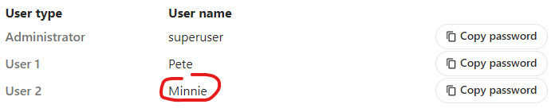

3. Click the "Content Management" link.
> 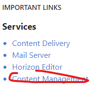

4. Fill in the fields of the "Log in" form and click the "Log in" button.
> 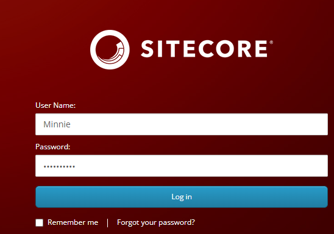

5. Click the "Experience Editor" tile.
> 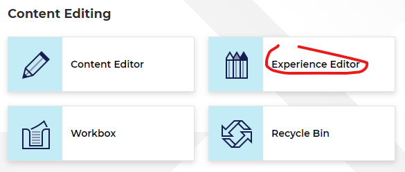

6. Expand the arrow in the "Warnings" tile.
> 

7. You will see that Minnie cannot edit this item, because she doesn't have an access to it.
> 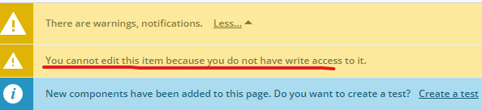

8. Expand the arrow near the "Home" section in the breadcrumb and click the "Articles" tile.
> 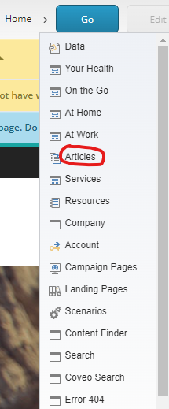

9. Click the "Go" button in the breadcrumb.
> 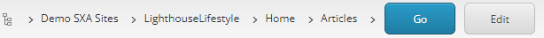

10. To add the new article, toggle the ribbon in the right-top corner of the page.
> 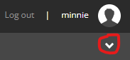

11. Click the "Insert page" icon in the "Home" tab.
> 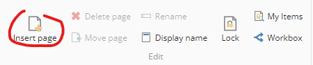

12. You will see an "Insert Item" pop-up window, fill in the "Name" field and click the "OK" button.
> 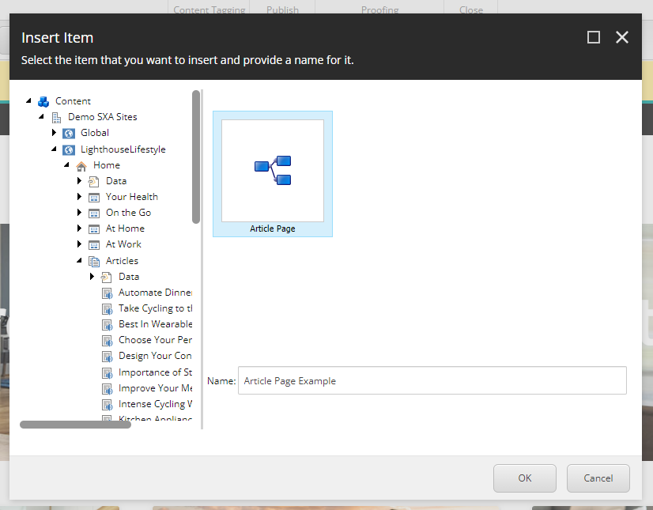

13. The new article has been created, you can update the content and images, if you want.
> 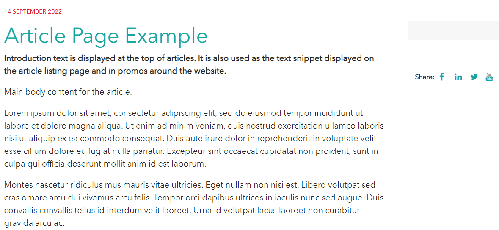

14. To submit this article for review of content approver, click the "Submit" button.
> 

15. You will see the "Enter a comment" pop-up window, leave comments in the "Comments" field and click the "OK" button.
> 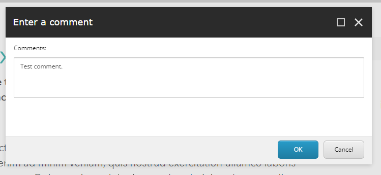

This scenario shows how content author can easily create the content and submit it for review.

## Content approver's review

1. Log out as a "Minnie" user.
> 

2. Copy password for "Pete" user.
> 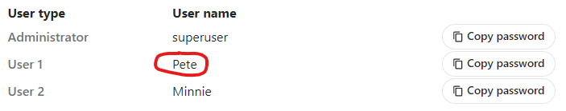

3. Log in as Pete to Lighthouse XP Demo, Mail Server service.
> 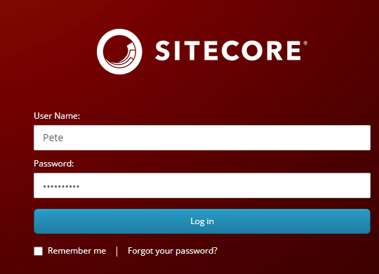

4. You will see the mail, which alerts you, that you have an item awaiting approval, click on it.
> 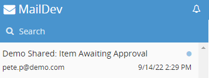

5. There is a mesage, that the item was submitting for approval by content author (Minnie). Click the "Sitecore Workbox" link to approve this item.
> 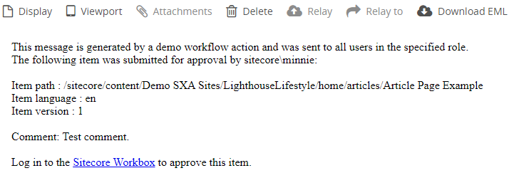

6. Scroll down the "Workflows" window and set the "Demo Workflow" checkbox.
> 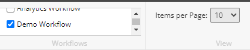

7. You will see 3 items awaiting approval.
> 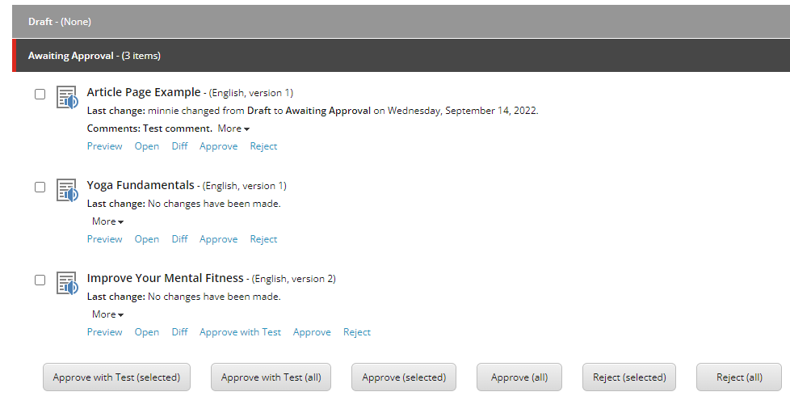

8. Click the "Approve" button under the "Article Page Example" item.
> 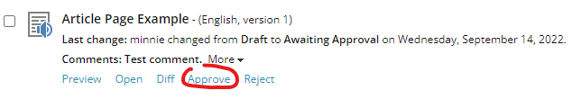

9. You will see the "Enter a comment" pop-up window, leave comments in the "Comments" field and click the "OK" button.
> 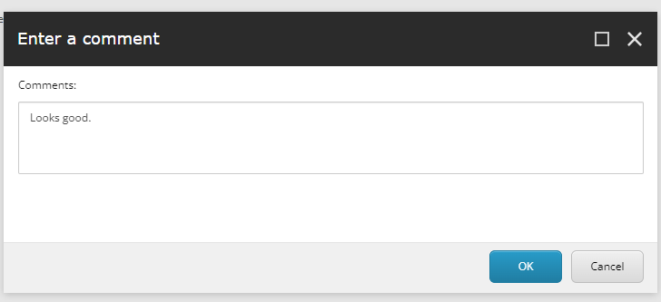

10. Our article has disappeared from the "Demo Workflow" tab.
> 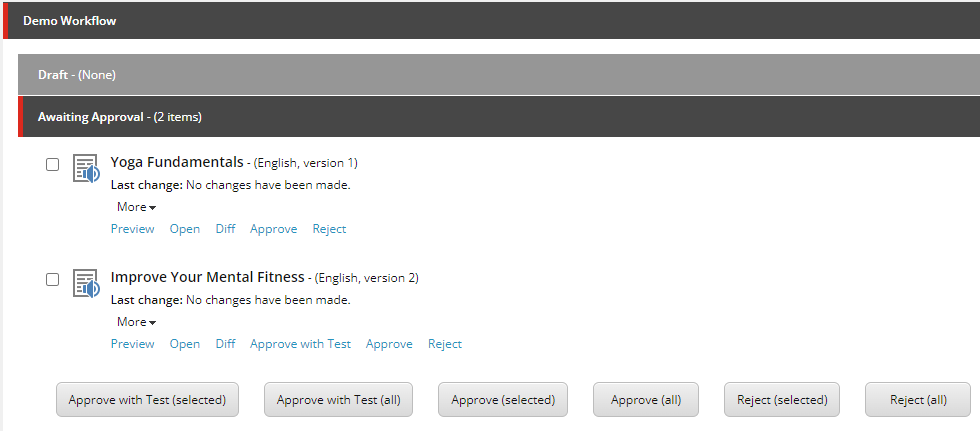

11. You have received the mail, that Minnie's article was approved by Pete as well.
> 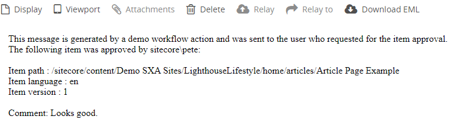

This scenario shows how the updated content can be easily reviewed and approved by the content approver.

