# A/B test

1. Log in to your Lighthouse XP demo instance.
2. Go to the demo website.
3. Scroll down to the bottom of the page and click the "Landing Pages" link in the footer.
> 

4. Go to "Active AB Test Example" landing page.
> 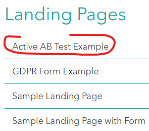

5. You will see one of the variants of multi-variant test.
> 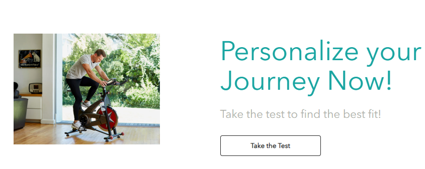

6. Open the visit details panel.
> 

7. Click the "New visitor" button to see another variant of test.
> 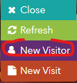

8. You will see the second variant of the test.
> 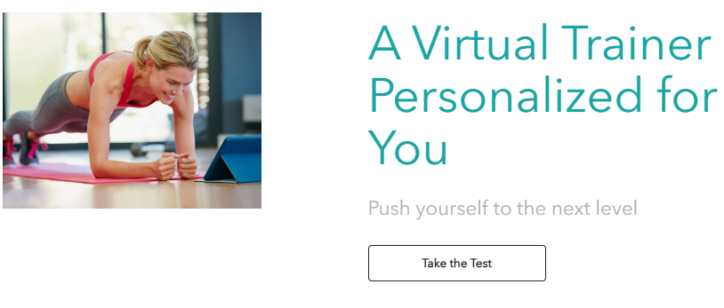

9. Open the visit details panel again and click the "New Visitor" one more time and you will see the last variant of the test.
> 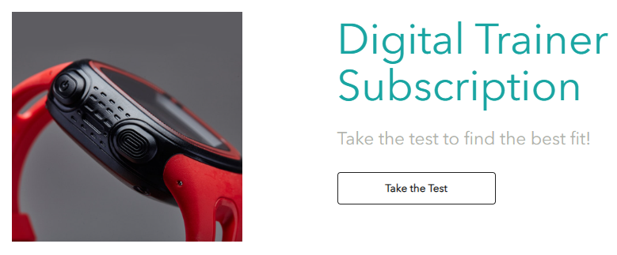

10. Open the visit details panel, click the "New Visit" button and refresh the page.
> 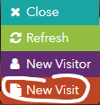

11. Then, you will see the same variant of the test, because you are the same visitor of the website.
> 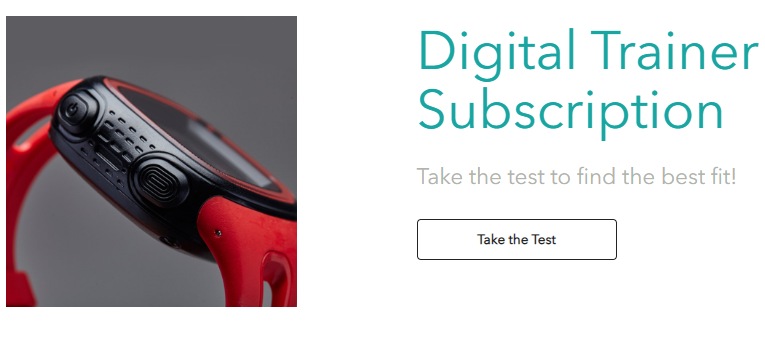

12. Return to your Lighthouse XP demo instance.
13. Click the "Content Management" link.
> 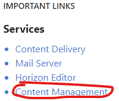

14. Click the "Experience Optimization" application in the "Marketing Applications" section.
> 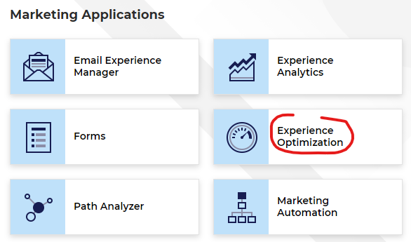

15. Click the "Active Tests" link in the Dashboard in the left-top corner of the page.
> 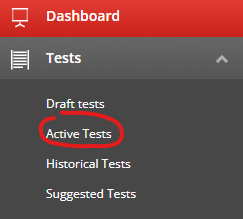

16. Choose the "healthy-living" test.
> 

17. Open the "Optimization" tab in Experience Editor.
> 

18. You will see the "Take the Test" section. Click in front of the image and the "Promo" pop-up window will appear.
>  

19. Click the arrow near the "Variation with Image 2" element and you will see the existing variants of this test.
> 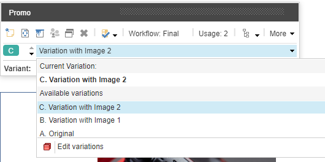

20. To see the reporting of the test, click the "Test result" button within the "Optimization" tab.
> 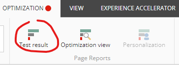

21. You will see the "Test result" pop-up window.
> 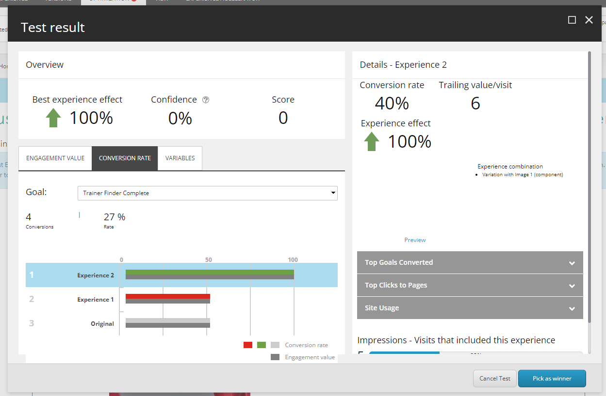

This scenario shows how to use a multi-variant test and identify the variant, which works best.
