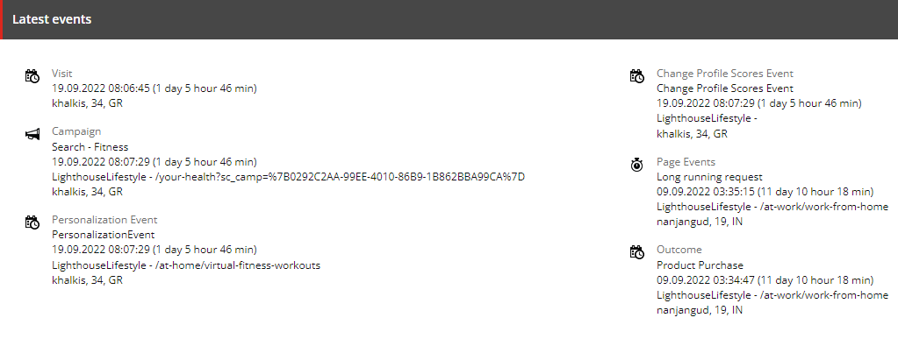
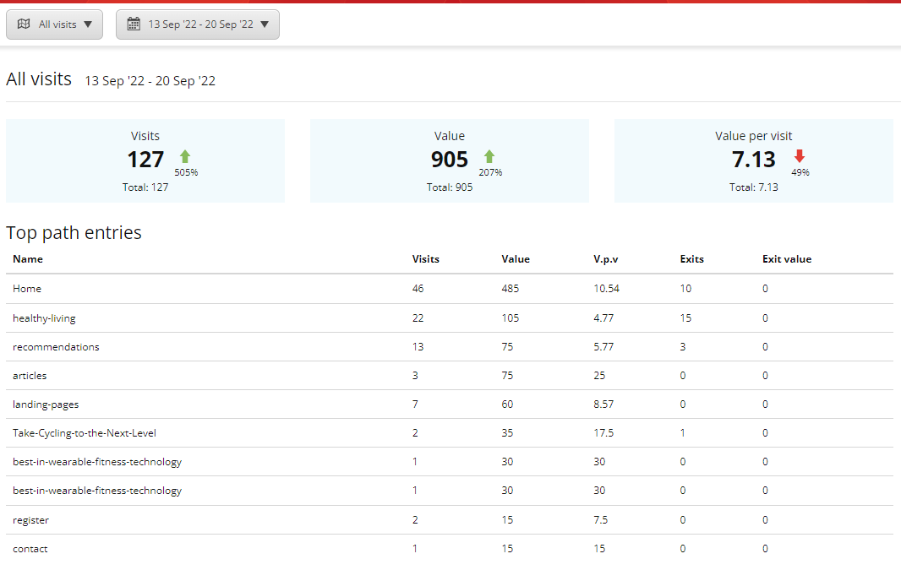
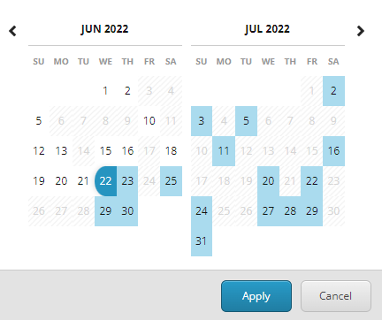
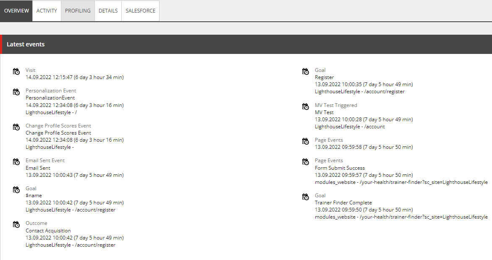

# Reporting view
## Experience Analytics functionality 

1. Log in to your Lighthouse XP demo instance.
2. Click the "Content Management" link, use "superuser" name and its password.
> 

3. Click the "Launchpad" icon in the left-top corner of the page.
> 

4. Click the "Experience Analytics" application in the "Marketing Applications" section.
> 

5. You will see the Dashboard with demo analytics, populated  for you there.
> 

6. Navigate to the "Behavior" tab and click the "By URL Pages" link.
> 

7. You will see multiple charts with data.
> 

8. Click the "Pattern matches" in the "Audience" tab.
> 

9. You will see how many visitors were profiled depending on their activity on the website.
> 

There are lots more useful features to explore in this tool.

# Experience Profile

1. Click the "Launchpad" icon again.
> 

2. Click the "Experience Profile" application in the "Marketing Applications" section.
> 

3. Click any name from the list to view individual information.
> 

4. You will see all the information of this visitor there.
> 

5. Click the "Activity" tab.
> 

6. You will see quantity of visits and events of this particular customer on the website.
> 

7. Click the "Profiling" tab.
> 

8. You will see the activity of this person there.
> 

This tool shows how to overview the individual information of each visitor and interact with it.

# Path Analyzer

1. Navigate to the Launchpad again.
2. Click the "Path Analyzer" application in the "Marketing Applications" section.
> 

3. You will see the "Dashboard" view, that gives an opportunity to track customer's journey.
> 

4. Click the "Vertical" view to better visualize customer's path on the website.
> 

5. Click the calendar icon and choose "Last 90 days" reporting view.
> 

6. Click the "Apply" button.
> 

7. You will see the chart there, where green nodes are individual pages in a customer's journey, which have a good conversion rate, and red ones with low conversion rate.
> 

8. You can click on a specific node to see the detailed path overview on the right.
> 
> 
> 
9. Click the "Contacts" tab in the "Selected path overview" section.
> 

10. You will see the contacts' information there.
> 

11. Click the "Open Experience Profile" link to return to the customers' individual information in "Experience Profile" application to improve the outcomes of their journey. 
> 
> 

> Sitecore Path Analyzer helps to indicate pages with successful conversion rate and understand areas, which need to be improved.