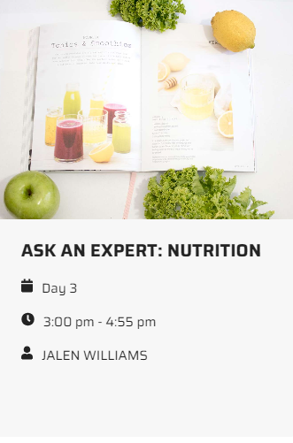
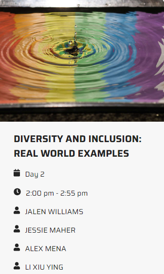
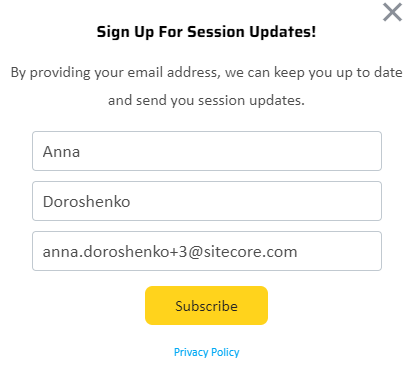
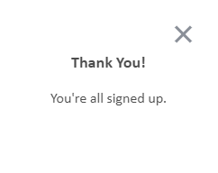

# Subscribe to update email campaign

1. Open the PLAY! Summit website in a new browsing session. 

2. Visit one of the sessions.

> 

1. Then go back and click on another session.

> 
>
1. You'll see a pop-up window at the bottom of the page, prompting you
    to sign up for session updates.

2. Fill in the subscription form.

1. You'll get "Thank You" message:

This will add the visitor to the "Newsletter Subscribers" email list.
